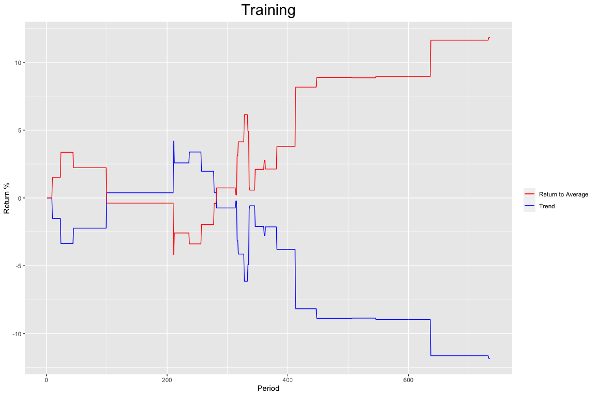
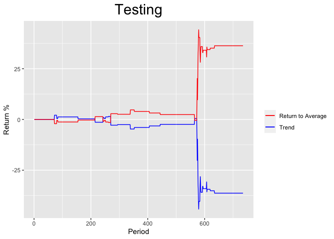
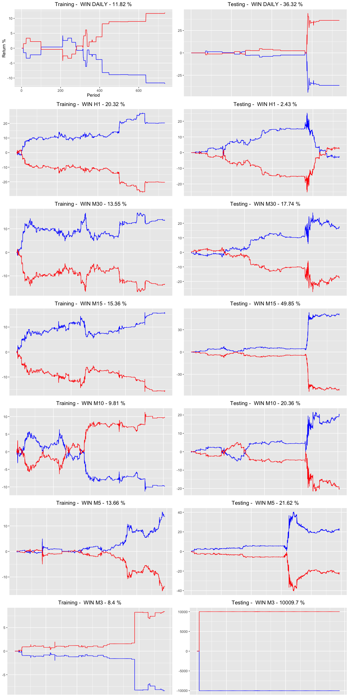
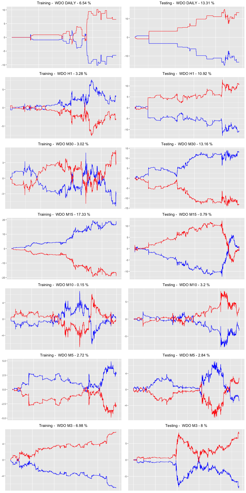

Description
-----------

The stock market price for an asset in a period usually varies inside a
range. It means that the prices in a big percent of the time will be
inside of this range. For example, usually, the price of an asset varies
from one day to another around from -3% to 3%. But in some moments we
can have some variance that escapes from the normal range because of an
external fact that affects the price of the asset. The Coronavirus
crisis is an example, when it started to affect the whole world many
different assets started to vary extremely and assets that usually
varied from -3% to 3% could have days varying around 12%. Less radical
events can. bring smaller variances and it is more normal to see in a
normal stock market day. For example, the same asset cited above varying
4%, 5%, 6%, …

The goal of this study is to verify how the asset behaviours in the next
period after an anomaly be detected.

Hypotheses and asset over investigation
---------------------------------------

The study will start evaluating the Brazilian mini index in a daily
period. The goal will be to detect anomalies in this asset and then
verify how the next day behaviors. The behavior can follow the anomaly
or return to the opposite direction. It means if the Brazilian mini
index usually fluctuates from -3% to 3% comparing the `Close` value from
one day to another and in one moment we have a variance of 5.7%. We want
to know how the asset will behave the next day. Will the asset follow
the same direction (trend following) or will it goes in the opposite
direction (return to the average). The null hypothesis is that every
time when an anomaly happens then the next period will follow the
anomaly direction. It means if the anomaly is positive the next period
will be positive too. To the alternative hypothesis, we say that the
next period after an anomaly always will go in the opposite direction of
the anomaly.

Brazilian mini index per day
----------------------------

</br>

``` r
# Load libraries
library(quantmod)
library(AnomalyDetection)
library(hrbrthemes)
library(ggplot2)
library(gridExtra)
library(dplyr)
```

The data are the daily prices for the Brazilian mini index from
10/20/2014 to 10/30/2020.

``` r
# Load data
asset <- read.csv('WIN$_Daily_201410200000_202010300000.csv', sep = '\t', header = TRUE)

head(asset)
```

    ##      X.DATE. X.OPEN. X.HIGH. X.LOW. X.CLOSE. X.TICKVOL. X.VOL. X.SPREAD.
    ## 1 2014.10.20   76665   77282  75472    76172     141387 342239         0
    ## 2 2014.10.21   73039   73946  72116    72941     163626 394149         0
    ## 3 2014.10.22   72628   73998  72213    72448     142727 345869         0
    ## 4 2014.10.23   71873   72122  69177    70022     174140 422085         0
    ## 5 2014.10.24   70547   73688  70078    71398     186986 477306         0
    ## 6 2014.10.27   66160   70443  65978    70153     177654 474781         0

The data has the date of each period and the values of open, high, low,
and close. Beyond that, we have some volume information and spread
information.

</br> Getting the description of the asset and verifying the missing
values.

``` r
# Data description
summary(asset)
```

    ##    X.DATE.             X.OPEN.          X.HIGH.           X.LOW.      
    ##  Length:1471        Min.   :  1001   Min.   : 48307   Min.   :  1001  
    ##  Class :character   1st Qu.: 70210   1st Qu.: 70954   1st Qu.: 69434  
    ##  Mode  :character   Median : 78096   Median : 79030   Median : 77271  
    ##                     Mean   : 81381   Mean   : 82266   Mean   : 80464  
    ##                     3rd Qu.: 94100   3rd Qu.: 95506   3rd Qu.: 93180  
    ##                     Max.   :119895   Max.   :120080   Max.   :118270  
    ##     X.CLOSE.        X.TICKVOL.          X.VOL.           X.SPREAD.     
    ##  Min.   : 48032   Min.   :     44   Min.   :     925   Min.   :0.0000  
    ##  1st Qu.: 70162   1st Qu.: 187312   1st Qu.:  496687   1st Qu.:0.0000  
    ##  Median : 78144   Median : 369794   Median : 1369122   Median :0.0000  
    ##  Mean   : 81451   Mean   : 973710   Mean   : 3403883   Mean   :0.0136  
    ##  3rd Qu.: 94328   3rd Qu.:1520656   3rd Qu.: 5713621   3rd Qu.:0.0000  
    ##  Max.   :119785   Max.   :5251157   Max.   :19141566   Max.   :5.0000

``` r
sapply(asset, function(x) sum(is.na(x)))
```

    ##    X.DATE.    X.OPEN.    X.HIGH.     X.LOW.   X.CLOSE. X.TICKVOL.     X.VOL. 
    ##          0          0          0          0          0          0          0 
    ##  X.SPREAD. 
    ##          0

</br> Cleaning data. Because we will use only the `Date` and `Close`
value then we will remove the other columns.

``` r
# Removing unnecessary columns
win <- subset(asset, select = c(X.DATE., X.CLOSE.))
win <- win %>% plyr::rename(c('X.DATE.' = 'Date', 'X.CLOSE.' = 'Close'))

head(win)
```

    ##         Date Close
    ## 1 2014.10.20 76172
    ## 2 2014.10.21 72941
    ## 3 2014.10.22 72448
    ## 4 2014.10.23 70022
    ## 5 2014.10.24 71398
    ## 6 2014.10.27 70153

</br> Shifting the close value to create the return. The return is the
`Close` value current divided by the `Close` value of the previous day.

``` r
# Calculate the return
win$Return <- (win$Close / data.table::shift(win$Close) - 1) * 100
win[is.na(win)] <- 0

head(win)
```

    ##         Date Close     Return
    ## 1 2014.10.20 76172  0.0000000
    ## 2 2014.10.21 72941 -4.2417161
    ## 3 2014.10.22 72448 -0.6758887
    ## 4 2014.10.23 70022 -3.3486087
    ## 5 2014.10.24 71398  1.9650967
    ## 6 2014.10.27 70153 -1.7437463

``` r
dim(win)
```

    ## [1] 1471    3

</br> Removes the `Close` column which is no more necessary.

``` r
win <- subset(win, select = c(Date, Return))

# Convert data type for datetime
win$Date <- as.POSIXct(win$Date, format = '%Y.%m.%d')

head(win)
```

    ##         Date     Return
    ## 1 2014-10-20  0.0000000
    ## 2 2014-10-21 -4.2417161
    ## 3 2014-10-22 -0.6758887
    ## 4 2014-10-23 -3.3486087
    ## 5 2014-10-24  1.9650967
    ## 6 2014-10-27 -1.7437463

</br> Dividing data between training and testing and detecting
anomalies.

``` r
# Detecting anomalies
train_size <- dim(win)[1] * 0.5

anomalies_win <- ad_ts(win[1:train_size,], max_anoms = 0.05, direction = 'both', alpha = 0.05)
dim(anomalies_win)
```

    ## [1] 5 2

``` r
head(anomalies_win)
```

    ## # A tibble: 5 x 2
    ##   timestamp           anoms
    ##   <dttm>              <dbl>
    ## 1 2014-11-21 00:00:00  6.03
    ## 2 2015-11-03 00:00:00  5.69
    ## 3 2016-03-03 00:00:00  5.29
    ## 4 2016-03-17 00:00:00  6.83
    ## 5 2017-05-18 00:00:00 -9.74

</br> Evaluating the anomalies for the Brazilian mini index.

``` r
## Chart for anomalies
ggplot() +
geom_line(
  data = win, aes(Date, Return), size = 0.125, color = 'blue'
) +
geom_point(data = anomalies_win, aes(timestamp, anoms), color = '#cb181d', alpha = 1/3) +
scale_x_datetime(date_labels = '%b/%y') +
scale_y_comma()
```


</br> The function to detect anomalies only detected the most extreme
values. To have a good number of anomalies is necessary to get a smaller
value for the anomalies instead of the five values detected. If to
consider a value as an anomaly the function is using a cutoff of 12% for
example then is necessary to decrease the cutoff.

To decrease the value which is the cutoff for anomalies is necessary to
divide the positive anomalies and the negative ones in groups. With the
two groups is possible to get the average value for each and divide per
2. Then, for example, if the previous cutoff was 12% then now it will be
6%.

``` r
multiplier <- 0.5

# Positive mean
anom_positive <- mean(data.matrix(anomalies_win[anomalies_win$anoms > 0, 'anoms'])) * multiplier

# Negative mean
anom_negative <- mean(data.matrix(anomalies_win[anomalies_win$anoms < 0, 'anoms'])) * multiplier

anom_positive
```

    ## [1] 2.97959

``` r
anom_negative
```

    ## [1] -4.87126

</br> Comparing the `Return` value with the average positive and
negative anomaly values and marking every row when its `Return` value is
bigger than the positive anomaly average value or smaller than the
negative anomaly average value.

``` r
TRAIN_WIN <- win[1:train_size,]
    
TRAIN_WIN$anoms <- ifelse(TRAIN_WIN$Return > anom_positive, 1, 0)
TRAIN_WIN$anoms <- ifelse(TRAIN_WIN$Return < anom_negative, -1, TRAIN_WIN$anoms)
    
sum(TRAIN_WIN$anoms != 0)
```

    ## [1] 27

The training data has 27 anomalies.

</br> Shifting the `Return` value one line above to create the target
value.

``` r
TRAIN_WIN$Target <- c(TRAIN_WIN$Return[-(seq(1))], rep(NA, 1))
TRAIN_WIN[is.na(TRAIN_WIN)] <- 0

head(TRAIN_WIN)
```

    ##         Date     Return anoms     Target
    ## 1 2014-10-20  0.0000000     0 -4.2417161
    ## 2 2014-10-21 -4.2417161     0 -0.6758887
    ## 3 2014-10-22 -0.6758887     0 -3.3486087
    ## 4 2014-10-23 -3.3486087     0  1.9650967
    ## 5 2014-10-24  1.9650967     0 -1.7437463
    ## 6 2014-10-27 -1.7437463     0  2.5615441

</br> Create training result in trend following

``` r
trend <- 1
TRAIN_WIN$Result <- TRAIN_WIN$anoms * TRAIN_WIN$Target * trend

result_trend_training <- cumsum(TRAIN_WIN$Result)
```

</br> Create training result in returning to the average

``` r
average <- -1
TRAIN_WIN$Result_Average <- TRAIN_WIN$anoms * TRAIN_WIN$Target * average
    
result_average_training <- cumsum(TRAIN_WIN$Result_Average)
```

</br> Plotting the result in trend following and in return to the
average to training data

``` r
result_training <- data.frame(result_trend_training, result_average_training)
result_training$id <- strtoi(row.names(result_training))
head(result_training)
```

    ##   result_trend_training result_average_training id
    ## 1                     0                       0  1
    ## 2                     0                       0  2
    ## 3                     0                       0  3
    ## 4                     0                       0  4
    ## 5                     0                       0  5
    ## 6                     0                       0  6

``` r
title <- 'Training'

training_chart <- ggplot(result_training, aes(x = id)) +
geom_line(aes(y = result_trend_training, color = 'Trend'), size = 0.5) +
geom_line(aes(y = result_average_training, color = 'Return to Average'), size = 0.5) +
scale_color_manual(values = c('Trend' = 'blue', 'Return to Average' = 'red')) +
labs(x = 'Period', y = 'Return %', title = title) +
theme(legend.title=element_blank(), plot.title = element_text(hjust = 0.5, size = 22))

training_chart
```



Now we will reproduce the same steps in the testing database to see the
result.

``` r
TEST_WIN <- win[(train_size + 1):dim(win)[1],]

TEST_WIN$anoms <- ifelse(TEST_WIN$Return > anom_positive, 1, 0)
TEST_WIN$anoms <- ifelse(TEST_WIN$Return < anom_negative, -1, TEST_WIN$anoms)
    
TEST_WIN$Target <- c(TEST_WIN$Return[-(seq(1))], rep(NA, 1))
TEST_WIN[is.na(TEST_WIN)] <- 0
    
head(TEST_WIN)
```

    ##           Date      Return anoms      Target
    ## 736 2017-10-06 -0.67483932     0 -0.08867267
    ## 737 2017-10-09 -0.08867267     0  0.89351036
    ## 738 2017-10-10  0.89351036     0  0.01664210
    ## 739 2017-10-11  0.01664210     0  0.28524567
    ## 740 2017-10-13  0.28524567     0 -0.26665719
    ## 741 2017-10-16 -0.26665719     0 -0.71417537

``` r
TEST_WIN$Result <- TEST_WIN$anoms * TEST_WIN$Target * trend
    
result_trend_testing <- cumsum(TEST_WIN$Result)
    
TEST_WIN$Result_Average <- TEST_WIN$anoms * TEST_WIN$Target * average
    
result_average_testing <- cumsum(TEST_WIN$Result_Average)
    
result_testing <- data.frame(result_trend_testing, result_average_testing)
result_testing$id <- strtoi(row.names(result_testing))
head(result_testing)
```

    ##   result_trend_testing result_average_testing id
    ## 1                    0                      0  1
    ## 2                    0                      0  2
    ## 3                    0                      0  3
    ## 4                    0                      0  4
    ## 5                    0                      0  5
    ## 6                    0                      0  6

``` r
title <- 'Testing'

testing_chart <- ggplot(result_testing, aes(x = id)) +
geom_line(aes(y = result_trend_testing, color = 'Trend'), size = 0.5) +
geom_line(aes(y = result_average_testing, color = 'Return to Average'), size = 0.5) +
scale_color_manual(values = c('Trend' = 'blue', 'Return to Average' = 'red')) +
labs(x = 'Period', y = 'Return %', title = title) +
theme(legend.title=element_blank(), plot.title = element_text(hjust = 0.5, size = 22))

testing_chart
```



In both charts is possible to notice that the null hypothesis which
claims that the next day will follow the anomaly trend is rejected and
in fact, in general, a day after an anomaly has the return to the
average.

Is the Brazilian mini index always return to the average in all time
frames?</br> How behavior another asset?

To answer these questions we will do the same process above to different
time frames and assets. The process will be done to the Brazilian mini
index and the mini dollar which are operated in the Brazilian stock
market. It will be done in the intraday and daily time frames.

</br> Creating a dictionary with the assets and time frames that will be
analysed.

``` r
assets <- vector(mode="list", length=14)
names(assets) <- c('WIN DAILY', 'WIN H1', 'WIN M30', 'WIN M15', 'WIN M10', 'WIN M5', 'WIN M3',
                   'WDO DAILY', 'WDO H1', 'WDO M30', 'WDO M15', 'WDO M10', 'WDO M5', 'WDO M3')

assets[[1]] <- list(file = 'WIN$_Daily_201410200000_202010300000.csv',
                    columns = c('Date', 'Open', 'High', 'Low', 'Close', 'Tick_Vol', 'Volume', 'Spread'),
                    multiplier = 0.5)
assets[[2]] <- list(file = 'WIN$_H1_201410200900_202010301800.csv',
                    columns = c('Date', 'Time', 'Open', 'High', 'Low', 'Close', 'Tick_Vol', 'Volume', 'Spread'),
                    multiplier = 0.5)
assets[[3]] <- list(file = 'WIN$_M30_201410200900_202010301800.csv',
                    columns = c('Date', 'Time', 'Open', 'High', 'Low', 'Close', 'Tick_Vol', 'Volume', 'Spread'),
                    multiplier = 0.5)
assets[[4]] <- list(file = 'WIN$_M15_201410200900_202010301800.csv',
                    columns = c('Date', 'Time', 'Open', 'High', 'Low', 'Close', 'Tick_Vol', 'Volume', 'Spread'),
                    multiplier = 0.5)
assets[[5]] <- list(file = 'WIN$_M10_201410200900_202010301800.csv',
                    columns = c('Date', 'Time', 'Open', 'High', 'Low', 'Close', 'Tick_Vol', 'Volume', 'Spread'),
                    multiplier = 0.5)
assets[[6]] <- list(file = 'WIN$_M5_201701201010_202010301800.csv',
                    columns = c('Date', 'Time', 'Open', 'High', 'Low', 'Close', 'Tick_Vol', 'Volume', 'Spread'),
                    multiplier = 0.5)
assets[[7]] <- list(file = 'WIN$_M3_201807301227_202010301800.csv',
                    columns = c('Date', 'Time', 'Open', 'High', 'Low', 'Close', 'Tick_Vol', 'Volume', 'Spread'),
                    multiplier = 1)
assets[[8]] <- list(file = 'WDO$_Daily_201212030000_202010300000.csv',
                    columns = c('Date', 'Open', 'High', 'Low', 'Close', 'Tick_Vol', 'Volume', 'Spread'),
                    multiplier = 0.5)
assets[[9]] <- list(file = 'WDO$_H1_201212030900_202010301700.csv',
                    columns = c('Date', 'Time', 'Open', 'High', 'Low', 'Close', 'Tick_Vol', 'Volume', 'Spread'),
                    multiplier = 0.5)
assets[[10]] <- list(file = 'WDO$_M30_201212030900_202010301730.csv',
                    columns = c('Date', 'Time', 'Open', 'High', 'Low', 'Close', 'Tick_Vol', 'Volume', 'Spread'),
                    multiplier = 0.5)
assets[[11]] <- list(file = 'WDO$_M15_201212030900_202010301745.csv',
                    columns = c('Date', 'Time', 'Open', 'High', 'Low', 'Close', 'Tick_Vol', 'Volume', 'Spread'),
                    multiplier = 0.5)
assets[[12]] <- list(file = 'WDO$_M10_201304161720_202010301750.csv',
                    columns = c('Date', 'Time', 'Open', 'High', 'Low', 'Close', 'Tick_Vol', 'Volume', 'Spread'),
                    multiplier = 0.5)
assets[[13]] <- list(file = 'WDO$_M5_201702011505_202010301755.csv',
                    columns = c('Date', 'Time', 'Open', 'High', 'Low', 'Close', 'Tick_Vol', 'Volume', 'Spread'),
                    multiplier = 0.5)
assets[[14]] <- list(file = 'WDO$_M3_201807301554_202010301757.csv',
                    columns = c('Date', 'Time', 'Open', 'High', 'Low', 'Close', 'Tick_Vol', 'Volume', 'Spread'),
                    multiplier = 0.5)
```

</br> Executing the same steps that were executed to the Brazilian mini
index in the daily time frame for all combinations of assets and time
frames created in the dictionary above to evaluate anomalies.

``` r
pos <- 1
graphs <- list()

for (a in assets) {
  current_graph <- list()
  
  # Load Data
  file <- a$file
  asset <- read.csv(file, sep = '\t', header = TRUE)
  
  # Set column names
  names(asset) <- a$columns

  ## Calculate the returns
  asset$Date_Shift <- lag(asset$Date)
  asset[c('Date_Shift')][is.na(asset[c('Date_Shift')])] <- ''
  asset$Return <- (asset$Close / data.table::shift(asset$Close) - 1) * 100
  asset[is.na(asset)] <- 0
  asset$Return <- ifelse('Time' %in% colnames(asset) & asset$Date != asset$Date_Shift, 0, asset$Return)
  asset$Date_Shift <- NULL
  
  if ('Time' %in% colnames(asset)) {
    asset$Date <- paste(asset$Date, asset$Time, sep = ' ')
  }

  sub_asset <- asset[, c('Date', 'Return')]
  if ('Time' %in% colnames(asset)) {
    sub_asset$Date <- as.POSIXct(sub_asset$Date, format = '%Y.%m.%d %H:%M:%S')
  } else {
    sub_asset$Date <- as.POSIXct(sub_asset$Date, format = '%Y.%m.%d')
  }
  
  asset <- subset(asset, select = c(Date, Return))
  
  # Detecting anomalies
  train_size <- dim(sub_asset)[1] * 0.5

  anomalies_asset <- ad_ts(sub_asset[1:train_size,], max_anoms = 0.05, direction = 'both', alpha = 0.05)
  dim(anomalies_asset)
  head(anomalies_asset)
  
  if(nrow(anomalies_asset) > 0) {
    ## Calculate the cutof value for anomalies
    multiplier <- a$multiplier
    
    anom_positive <- mean(data.matrix(anomalies_asset[anomalies_asset$anoms > 0, 'anoms'])) * multiplier
    anom_negative <- mean(data.matrix(anomalies_asset[anomalies_asset$anoms < 0, 'anoms'])) * multiplier
    
    anom_positive
    anom_negative
    
    ## Create training dataset
    TRAIN_ASSET <- asset[1:train_size,]
    
    TRAIN_ASSET$anoms <- ifelse(TRAIN_ASSET$Return > anom_positive, 1, 0)
    TRAIN_ASSET$anoms <- ifelse(TRAIN_ASSET$Return < anom_negative, -1, TRAIN_ASSET$anoms)
    
    sum(TRAIN_ASSET$anoms != 0)
    
    ## Create a target
    TRAIN_ASSET$Target <- c(TRAIN_ASSET$Return[-(seq(1))], rep(NA, 1))
    TRAIN_ASSET[is.na(TRAIN_ASSET)] <- 0
    
    
    ## Create training result in trend following
    trend <- 1
    TRAIN_ASSET$Result <- TRAIN_ASSET$anoms * TRAIN_ASSET$Target * trend
    
    result_trend_training <- cumsum(TRAIN_ASSET$Result)
    
    ## Create training result in returning to the average
    average <- -1
    TRAIN_ASSET$Result_Average <- TRAIN_ASSET$anoms * TRAIN_ASSET$Target * average
    
    result_average_training <- cumsum(TRAIN_ASSET$Result_Average)
    
    ## Chart of the training results
    result_training <- data.frame(result_trend_training, result_average_training)
    result_training$id <- strtoi(row.names(result_training))
    head(result_training)
    
    perc_trend <- last(result_training$result_trend_training)
    perc_average <- last(result_training$result_average_training)
    max_percent <- max(c(perc_trend, perc_average))
    
    title <- paste('Training - ', paste(names(assets)[pos],
                   paste(round(max_percent, digits = 2), '%'),
                   sep = ' - '))
    training_chart <- ggplot(result_training, aes(x = id)) +
      geom_line(aes(y = result_trend_training, color = 'Trend'), size = 0.5) +
      geom_line(aes(y = result_average_training, color = 'Return to Average'), size = 0.5) +
      scale_color_manual(values = c('Trend' = 'blue', 'Return to Average' = 'red'))
    
      if (pos == 1) {
        training_chart <- training_chart +
          labs(
            x = 'Period',
            y = 'Return %',
            title = title
          ) +
          theme(legend.position = 'none',
                plot.title = element_text(hjust = 0.5))
      } else {
        training_chart <- training_chart +
          labs(
            title = title
          ) +
          theme(legend.position = 'none',
                axis.text.x = element_blank(),
                axis.title.x = element_blank(),
                axis.ticks.x = element_blank(),
                axis.title.y = element_blank(),
                plot.title = element_text(hjust = 0.5))
      }
    
    ## Create training dataset
    TEST_ASSET <- asset[(train_size + 1):dim(asset)[1],]
    
    TEST_ASSET$anoms <- ifelse(TEST_ASSET$Return > anom_positive, 1, 0)
    TEST_ASSET$anoms <- ifelse(TEST_ASSET$Return < anom_negative, -1, TEST_ASSET$anoms)
    
    ## Create a target
    TEST_ASSET$Target <- c(TEST_ASSET$Return[-(seq(1))], rep(NA, 1))
    TEST_ASSET[is.na(TEST_ASSET)] <- 0
    
    head(TEST_ASSET)
    
    ## Create testing result in trend following
    TEST_ASSET$Result <- TEST_ASSET$anoms * TEST_ASSET$Target * trend
    
    result_trend_testing <- cumsum(TEST_ASSET$Result)
    
    ## Create testing result in returning to the average
    TEST_ASSET$Result_Average <- TEST_ASSET$anoms * TEST_ASSET$Target * average
    
    result_average_testing <- cumsum(TEST_ASSET$Result_Average)
    
    ## Chart of the testing results
    result_testing <- data.frame(result_trend_testing, result_average_testing)
    result_testing$id <- strtoi(row.names(result_testing))
    
    perc_trend <- last(result_testing$result_trend_testing)
    perc_average <- last(result_testing$result_average_testing)
    max_percent <- max(c(perc_trend, perc_average))
    
    title <- paste('Testing - ', paste(names(assets)[pos],
                   paste(round(max_percent, digits = 2), '%'),
                   sep = ' - '))
    testing_chart <- ggplot(result_testing, aes(x = id)) +
      geom_line(aes(y = result_trend_testing, color = 'result_trend_testing'), size = 0.5) +
      geom_line(aes(y = result_average_testing, color = 'result_average_testing'), size = 0.5) +
      labs(
        title = title
      ) +
      theme(legend.position = 'none',
            axis.text.x = element_blank(),
            axis.title.x = element_blank(),
            axis.ticks.x = element_blank(),
            axis.title.y = element_blank(),
            plot.title = element_text(hjust = 0.5)) +
      scale_color_manual(values = c('result_trend_testing' = 'blue', 'result_average_testing' = 'red'))
      
    
    current_graph <- list(training_chart, testing_chart)
    graphs[[pos]] <- current_graph
    
    pos <- pos + 1
  }
}

## Plotting the charts to Brazilian mini index
win_graphs <- graphs[startsWith(names(assets), 'WIN')]
if (length(win_graphs) > 0) {
  grid.arrange(grobs = unlist(win_graphs, recursive = FALSE),
            ncol = 2, nrow = round(length(win_graphs)))
}
```



``` r
## Plotting the charts to Dollar mini
wdo_graphs <- graphs[startsWith(names(assets), 'WDO')]
if (length(wdo_graphs) > 0) {
  grid.arrange(grobs = unlist(wdo_graphs, recursive = FALSE),
               ncol = 2, nrow = round(length(wdo_graphs)))
}
```



The previous charts present the result for the Brazilian mini index and
the Dollar mini in different time frames. It is possible to note that
different combinations have different results. The Brazilian mini index
in the Daily time frame returns to the average and in the M5 (5 minutes)
time frame follows the trend. There are assets and time frame
combinations that have different results between training and testing
datasets.

Looks like in some combinations between asset and time frame the results
are good and consistent between training and testing. The next step
would be to evaluate if it is possible to create a trading strategy
using this information.

Some question that can help to start to create a trading strategy:
<ul>
<li>
What is a good stop loss to the period after an anomaly?
</li>
<li>
Can other periods be evaluated instead of the next period after an
anomaly? This study evaluates the next period after an anomaly happens,
and if it evaluates two, three, … periods after the anomaly happens?
</li>
<li>
If instead to evaluate the periods it evaluates a moving average price
for n periods can it give a better result and become a trading system?
</li>
</ul>

</br></br>
